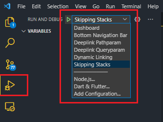
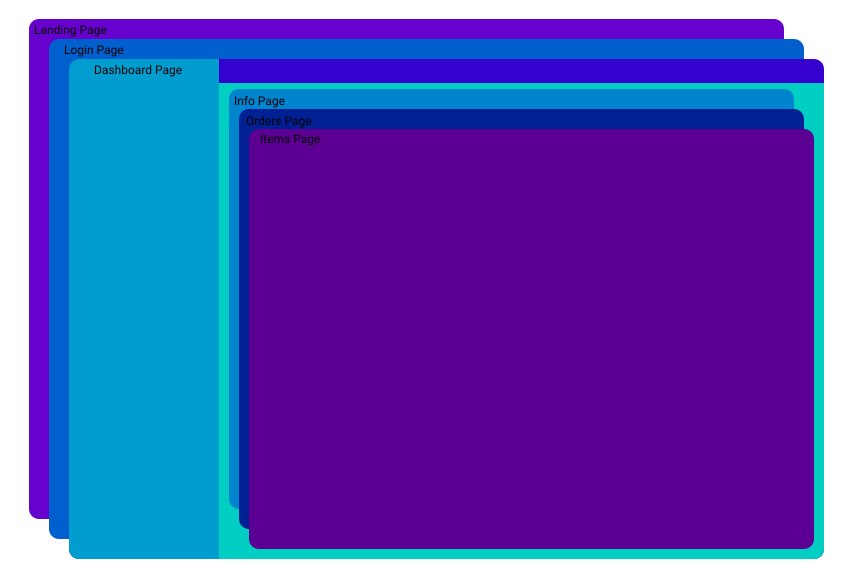
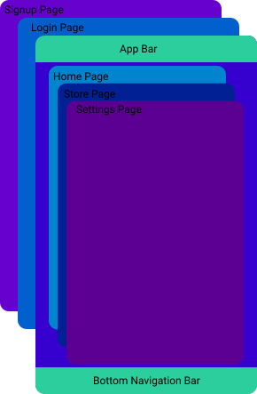

# Samples For [QlevarRouter](https://github.com/SchabanBo/qlevar_router)

- [Samples For QlevarRouter](#samples-for-qlevarrouter)
  - [Common use cases](#common-use-cases)
    - [Dashboard](#dashboard)
    - [Bottom Navigation Bar](#bottom-navigation-bar)
    - [Tab view](#tab-view)
    - [Navigation rail](#navigation-rail)
  - [Examples](#examples)
    - [Can Pop](#can-pop)
    - [Return data](#return-data)
    - [Temporary Route](#temporary-route)
  - [Flutter UXR](#flutter-uxr)
  - [More Samples](#more-samples)

To test the samples, clone this repo open with VSCode and chose the sample you want to run

## Common use cases

### Dashboard

A website with this structure can be done like [this](lib/common_cases/dashboard.dart)

And now from anywhere from your code you can call `QR.to('/dashboard/orders')` and if the user logged in, then the info page in the dashboard will be opened

### Bottom Navigation Bar

An app with this structure can be done like [this](lib/common_cases/bottom_nav_bar.dart)

### [Tab view](lib/common_cases/tab_view.dart)

### [Navigation rail](lib/common_cases/nav_rail.dart) 

## Examples

### [Can Pop](lib/examples/can_pop.dart)

This example shows how to use the `canPop` function to prevent the user from leaving the page if he has unsaved data.

### [Return data](lib/examples/return_data.dart)

This example shows how to return data from the page that you navigate to.

### [Temporary Route](lib/examples/temporary_route.dart)

This example will show how to use the temporary route to show a page or just a bottom sheet that contains this page depending on the screen width.

## Flutter UXR

Here you can find the code for the scenarios described in the [storyboards](https://github.com/flutter/uxr/tree/master/nav2-usability/storyboards) from [flutter uxr project](https://github.com/flutter/uxr)

- [Deeplink Pathparam](lib/flutter_uxr/deeplink_pathparam.dart)
- [Deeplink Queryparam](lib/flutter_uxr/deeplink_queryparam.dart)
- [Dynamic Linking](lib/flutter_uxr/dynamic_linking.dart)
- [Skipping Stacks](lib/flutter_uxr/skipping_stacks.dart)
- [Sign in Routing](lib/flutter_uxr/sign_in_routing.dart)

## More Samples

if you want a new samples for new use case fell free to open an issue describing in it the use case you want or you can add it your self with pull request :smile:
